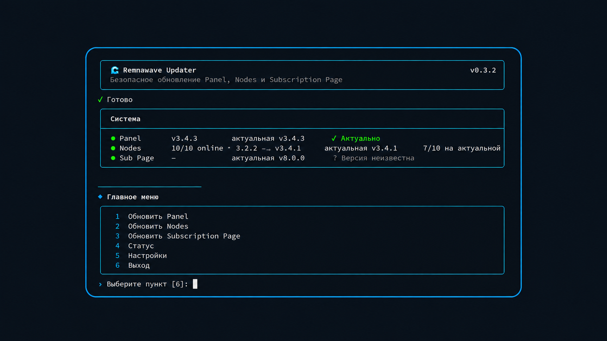

<div align="center">



# 🌊 Remnawave Updater

**CLI для быстрого и безопасного обновления Remnawave Panel, Nodes и Subscription Page.**

[English](README_EN.md) · [MIT License](LICENSE)

</div>

## Установка

```bash
git clone https://github.com/bruhxax/remnawave-updater.git
cd remnawave-updater
sudo ./install.sh
```

## Запуск

```bash
updater
```

## Обновление Updater

```bash
cd ~/remnawave-updater
git pull
sudo ./install.sh --no-setup
```

Настройки Panel, API token и SSH-ключи сохраняются.

---

<div align="center">
<sub>by <a href="https://github.com/bruhxax">bruhxax</a></sub>
</div>
